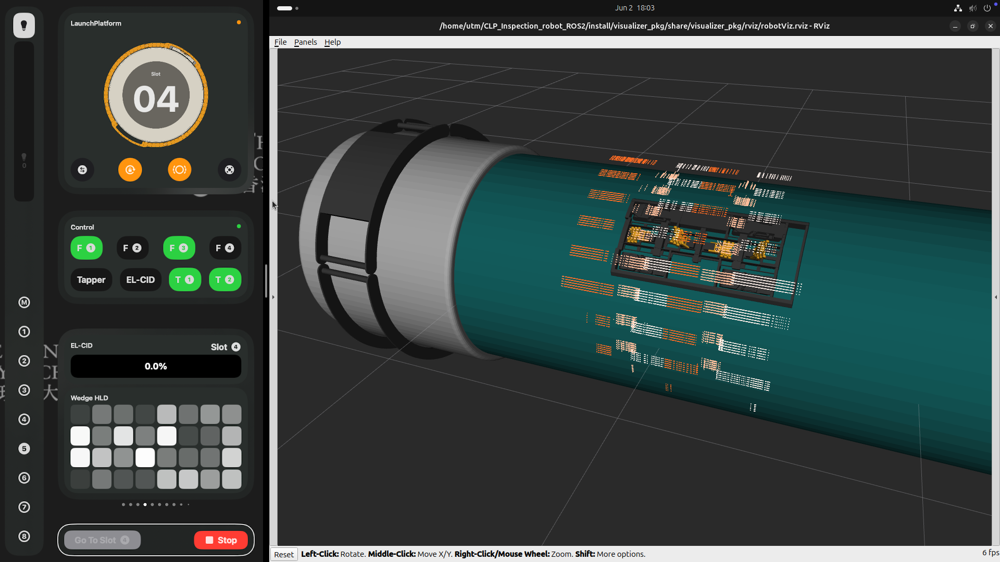

# CLP Inspection Robot Panel

The CLP Inspection Robot Panel is a software application designed to control and monitor inspection robots used in the CLP (China Light & Power). This repository contains all the necessary code and documentation to set up and use the panel.

## Features

- **Real-time Monitoring & Status Tracking**: Live monitoring of inspection robot status, including a conditional pressure view and advanced automation status tracking.
- **Robot Control & Navigation**: Comprehensive control and navigation of inspection robots.
- **Automation Modes**: Easily switch between and manage different automation modes via a dedicated selection menu.
- **Data Visualization & Analysis**: Real-time feedback and data visualization.
- **Modern User Interface**: A highly optimized, user-friendly UI with responsive layouts, improved readability, and tabbed navigation.

## Related Repository

This repository contains the GUI control panel software for the inspection robot. For the robot's core ROS2 source code, hardware details, and backend implementation, please visit the main robot repository:

- [CLP_Inspection_robot_ROS2](https://github.com/Leung-Kam-Ho/CLP_Inspection_robot_ROS2)

## License

This project is licensed under the [MIT License](./LICENSE).

## Contact
